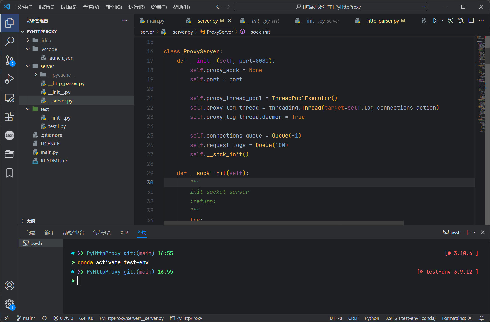

# Jetbrains New Dark Theme

## CAUTION

This is not a fully test theme. By now it's only pass through python syntax support. If you have any questions or advices when coding other language with this theme. Please tell [me](https://github.com/Michaelzhouisnotwhite/Jetbrains-New-Dark-Theme/issues)!

## Description

🚀🚀🚀 A VScode theme based on Jetbrains New Ui on Dark Theme.

<!-- ## Syntax Support

- Python
- Javascript
- TypeScript
- React, Vue
- HTML
- Markdown
- JSON
- CSS, SCSS
- Dockerfile
- Go
- More and more... -->

## Installation

Install from marketplace <https://marketplace.visualstudio.com/items?itemName=MichaelZhou.jetbrains-new-dark-theme>

### Install Jetbrains Mono

- Downloaded and install JetBrains Mono font <https://www.jetbrains.com/lp/mono>

- Add this snippet in your "settings.json":

```js
  "editor.fontFamily": "JetBrains Mono, Consolas, 'Courier New', monospace",
  "editor.fontSize": 14,
  "editor.lineHeight": 1.6,
```

## Screenshots

<!-- **The origin screenshot:**


**Vscode with Jetbrain Fleet🚀**



Screenshot of vue.js


Screenshot of python -->


**Enjoy!**

If you have any suggestions, create an issue on <https://github.com/Michaelzhouisnotwhite/Jetbrains-New-Dark-Theme/issues>

